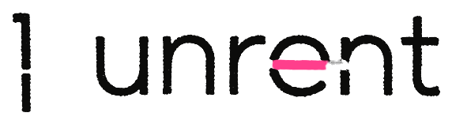

# Brand: stringcutter and unrent

What the brand is and how it looks, so it stays the same wherever it is used. Decided
2026-10-04.

## Who

**stringcutter** makes small, sharp tools that cut the strings between your code and the
companies that rent it to you.

**unrent** is its first tool: it shows which AI services a codebase depends on, what open
source can replace them, and which models are about to stop working.

- Name: always lowercase, one word: `stringcutter`, `unrent`. "unrent by stringcutter".
- Line: *Find the strings your AI code hangs by. Cut them before they snap.*
- Short line: *Cut the strings.*

## What we believe

Software is better when you own it. Every dependency on a closed service is a string.
Some are fine, but you should know where they are before they snap.

## The promise

- We show what we find, with file and line, and measure how accurate we are.
- Your code never leaves your machine.
- Our own products don't tie you in: cancel any time, export everything, run it
  yourself. A company called stringcutter that sells strings would be a joke.

## Vision

Software that doesn't hang by strings it doesn't know about. Tools that help developers
see their dependencies, cut them, and stay free, without becoming a new string.

## Voice

Short, concrete, a little dry. Numbers instead of adjectives. Never scare people: show
the string, say what it costs, and leave the decision to them.

Words the product uses, and nothing else for the same things:

| Word | Means |
|---|---|
| string | one dependency on a closed service, or a model the code selects |
| `cut` | a closed service with an open source replacement |
| `held` | a closed service with no open source replacement yet |
| `snapped` | a model the vendor has shut down; calls fail today |
| `snaps` | a model the vendor shuts down on a known date |
| `runs` | open source AI the code already runs |

## Logo

The mark `╎` (a vertical string with a gap) and the wordmark in lowercase, set in a round
geometric sans. A pink string runs through one letter and is cut: through the `e` in
unrent and in stringcutter. `╎` is the same glyph the terminal shows for `cut`, so the
logo and the product are one sign.

| File | On |
|---|---|
| [`unrent.png`](unrent.png) | light backgrounds: ink black, pink string |
| [`unrent-on-dark.png`](unrent-on-dark.png) | dark backgrounds: paper white, pink string |

- Transparent PNGs, about 570 px wide: fine for screens, too small for print. Print and
  large sizes need a vector version, drawn after these.
- The stringcutter wordmark exists in the same style (generated image, background
  removed); it is not in this repo yet.
- Never: recolour the string, add effects or glow, put the black version on a dark
  background, or stretch it.

## Colour

| Name | Hex | Use |
|---|---|---|
| Ink | `#0C0C0B` | text and dark surfaces |
| Paper | `#F1EEE8` | light surfaces, text on dark; warm, not white |
| String | `#FF3F8C` | the only brand colour: the string, the cut, one word that matters. At most 5 % of a surface |
| Muted | `#8D8982` | secondary text on dark |
| Amber | `#F2B544` | in the product only, for `snaps`. Never in brand or marketing |

No gradients. Pink is never a background for text.

## Type

- **JetBrains Mono** (OFL) for the product, code, numbers, labels and URLs.
- **Barlow** (OFL) for longer text on the web and in documents; Barlow Condensed 800 for
  large headlines where the wordmark style is not used.

## Look

Hand and machine. The brand side is tactile: paper, ink, a real pink thread, scanned
texture, macro photos of a thread being cut. The product side is precise: the terminal,
monospace, file and line. Facts are shown in mono; claims and feelings in the brand's own
hand. One pink element per surface.

Avoid: scissors as an icon, knots, puppets and strings-on-a-puppet imagery, neon glow,
AI gradients, robots and brains, stock photos of people at laptops, cute doodles.

## Images

Generated with image models (Replicate: Ideogram for anything with text, Recraft for
vector marks, Flux for photos). Generated logos are sketches: the final mark is drawn
and vectorised by hand, so it is ours, also as a trademark.
